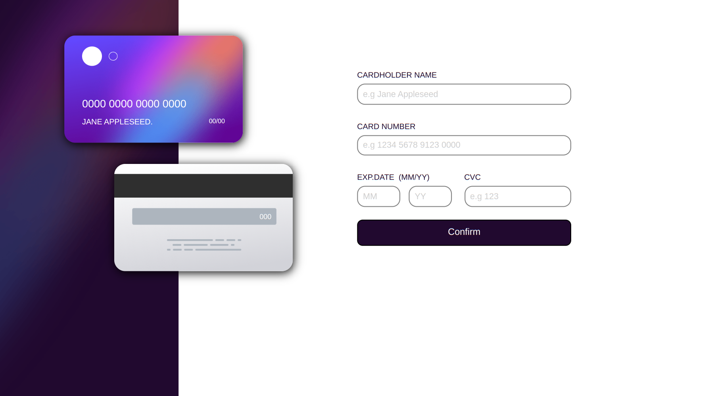
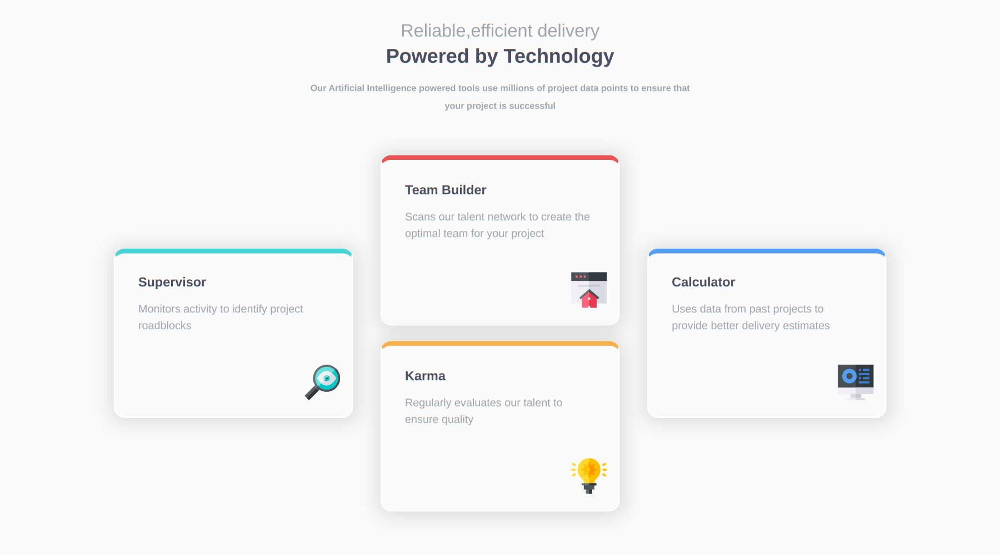

# Olá, &#128587;
#

Este é o repositório dos meus projetos realizados através do site Front-End Mentor.

> Front-End Mentor é uma plataforma que oferece desafios práticos de design e desenvolvimento web para aprimorar habilidades e conhecimentos. Cada projeto consiste em uma tela de design responsiva que deve ser recriada utilizando HTML, CSS e JavaScript.

Aqui você encontrará os projetos que completei até o momento, com o código fonte e um link para visualizá-los em funcionamento.

Espero que esses projetos possam servir como um exemplo do meu trabalho e como uma forma de compartilhar meus conhecimentos e experiências.

Obrigado por visitar! &#128582;

# 

## card perfume

[ live view ](https://lucieudo-roberto.github.io/frontend-mentor/desafio_01/)
#
## Interactive card details form

[ live view ](https://lucieudo-roberto.github.io/frontend-mentor/desafio_01/)
#
## Four card feature section

[ live view ](https://lucieudo-roberto.github.io/frontend-mentor/desafio_03/)

## Single Price Grid Component

[ live view ](https://lucieudo-roberto.github.io/frontend-mentor/desafio_04/)

##  Base Apparel coming soon page

[ live view ](https://lucieudo-roberto.github.io/frontend-mentor/desafio_05/)